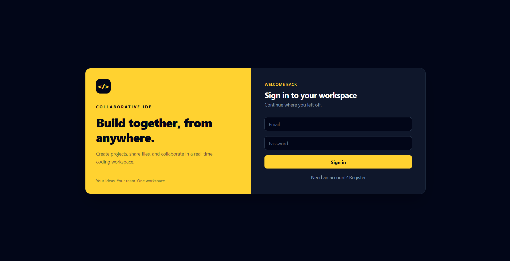
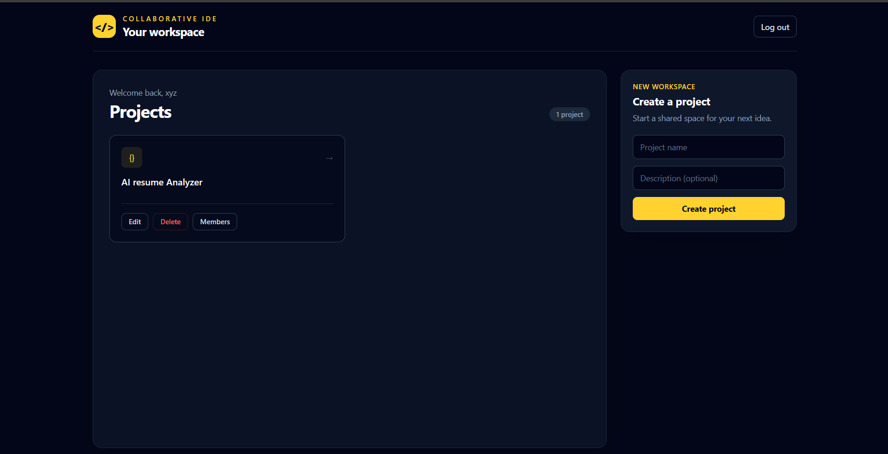
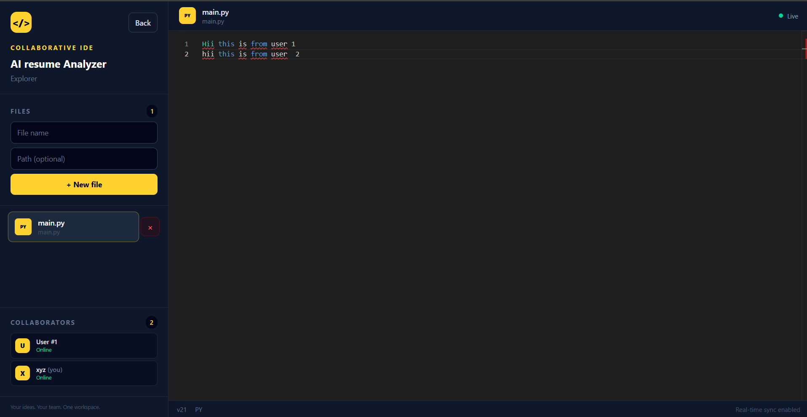
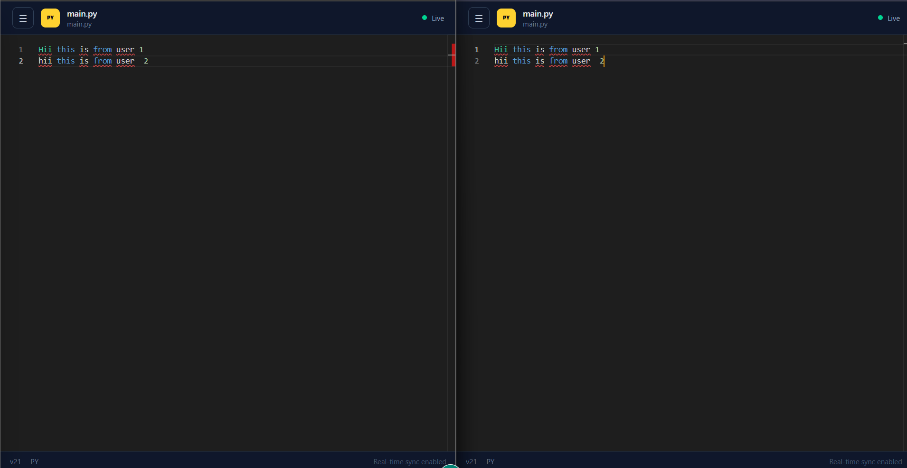
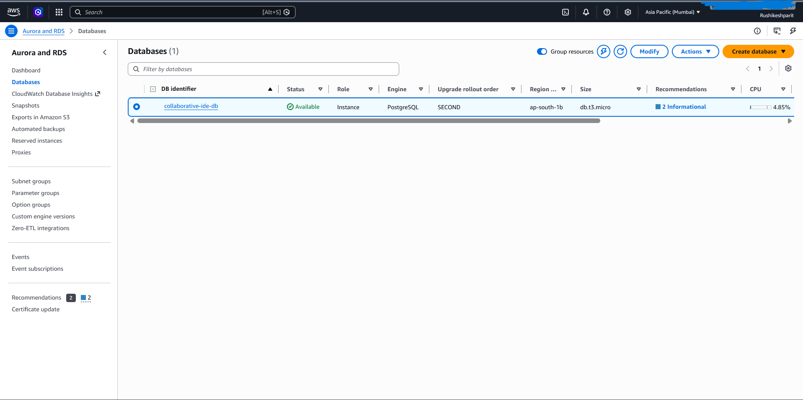
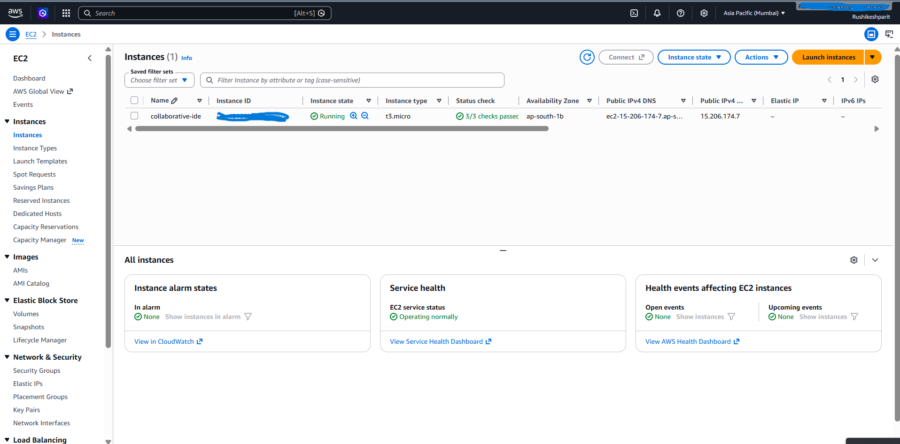

# Collaborative IDE

A full-stack real-time collaborative code editor where multiple users can work on the same project and edit files together.

## 🚀 Live Demo

**Live Application:** `http://15.206.174.7/`

> Replace `15.206.174.7` with your current AWS EC2 public IP.

## Screenshots

### 1. Login


### 2. Project Dashboard


### 3. Collaborative Code Editor


### 4. Real-Time Collaboration


### 5. AWS Deployment


### 5. AWS Deployment



## ✨ Features

- JWT authentication
- Project creation and management
- Project members and access control
- File explorer with create, update and delete operations
- Monaco Editor
- Real-time collaboration using WebSockets
- Yjs-based CRDT synchronization
- Real-time collaborator cursors
- Online collaborator tracking
- File version/conflict handling
- Dockerized frontend and backend
- Nginx reverse proxy
- AWS EC2 deployment
- PostgreSQL on AWS RDS

---

## 🏗️ Architecture

```text
                         Internet
                            │
                            ▼
                    ┌────────────────┐
                    │    AWS EC2     │
                    │    Port 80     │
                    └───────┬────────┘
                            │
                            ▼
                       ┌─────────┐
                       │  Nginx  │
                       └────┬────┘
                            │
              ┌─────────────┴─────────────┐
              │                           │
              ▼                           ▼
       React Frontend              FastAPI Backend
       Monaco Editor               REST API + WebSocket
                                          │
                                          ▼
                                   ┌──────────────┐
                                   │ AWS RDS      │
                                   │ PostgreSQL   │
                                   └──────────────┘
```

## 🔄 Real-Time Collaboration

The editor uses WebSockets and Yjs to synchronize changes between connected users.

```text
User A
  │
  │ edit
  ▼
Monaco Editor
  │
  ▼
Yjs / WebSocket
  │
  ├──────────────► User B
  │
  └──────────────► User C
```

---

## 🛠️ Tech Stack

### Frontend
- React
- Vite
- Monaco Editor
- Yjs
- y-monaco

### Backend
- Python
- FastAPI
- Uvicorn
- SQLAlchemy
- PostgreSQL
- JWT Authentication
- WebSockets

### DevOps / Deployment
- Docker
- Docker Compose
- Nginx
- AWS EC2
- AWS RDS

---

## 📂 Project Structure

```text
Collaborative-IDE/
│
├── backend/
│   ├── auth.py
│   ├── database.py
│   ├── main.py
│   ├── models.py
│   └── schemas.py
│
├── frontend/
│   ├── src/
│   │   ├── app/
│   │   │   ├── App.jsx
│   │   │   ├── Auth.jsx
│   │   │   ├── Projects.jsx
│   │   │   └── Editor.jsx
│   │   ├── lib/
│   │   │   ├── api.js
│   │   │   └── diff.js
│   │   └── main.jsx
│   ├── package.json
│   └── vite.config.js
│
├── docs/
│   ├── screenshots/
│   └── demo.gif
│
├── Dockerfile.backend
├── Dockerfile.frontend
├── docker-compose.yml
├── nginx.conf
├── requirements.txt
├── .dockerignore
├── .gitignore
└── README.md
```

---

## 🔐 Authentication & Authorization

The backend provides JWT-based authentication.

Users can:

- Register
- Login
- Access their profile
- Create projects
- Access projects they own or are members of
- Manage project files according to their permissions

Project-level access checks are performed by the backend before protected operations.

---

## 🔌 API

### Authentication

```text
POST /register
POST /login
GET  /me
```

### Projects

```text
POST   /projects
GET    /projects
GET    /projects/{project_id}
PUT    /projects/{project_id}
DELETE /projects/{project_id}
```

### Members

```text
POST /projects/{project_id}/members
GET  /projects/{project_id}/members
```

### Files

```text
POST   /projects/{project_id}/files
GET    /projects/{project_id}/files
GET    /files/{file_id}
PUT    /files/{file_id}
DELETE /files/{file_id}
```

### WebSocket

```text
/ws/projects/{project_id}
```

---

## 🐳 Run Locally with Docker

### 1. Clone

```bash
git clone https://github.com/Russhii/Collaborative-IDE.git
cd Collaborative-IDE
```

### 2. Create `.env`

Create `.env` in the project root:

```env
DATABASE_URL=your_database_url
SECRET_KEY=your_secret_key
ALGORITHM=HS256
ACCESS_TOKEN_EXPIRE_MINUTES=30
```

**Never commit `.env` or real secrets to GitHub.**

### 3. Build and start

```bash
docker compose up --build
```

Open:

```text
http://localhost
```

---

## ☁️ AWS Deployment

The application is deployed using:

```text
AWS EC2
   │
   ├── Docker
   │    ├── React + Nginx container
   │    └── FastAPI container
   │
   └── AWS RDS PostgreSQL
```

### EC2

Runs the Dockerized application.

### RDS

Hosts the PostgreSQL database separately from the application server.

### Nginx

Serves the React production build and proxies:

```text
/api/*  → FastAPI
/ws/*   → FastAPI WebSocket
```

---

## 🧠 Technical Highlights

### WebSockets
Persistent communication for real-time collaboration.

### Yjs / CRDT
Synchronizes editor state and supports concurrent editing.

### Monaco Editor
Provides the browser-based code editor.

### Docker
Frontend and backend are packaged as separate containers.

### Nginx
Acts as the reverse proxy and serves the production React build.

### AWS RDS
Provides managed PostgreSQL storage for the backend.

---

## 🔒 Environment Variables

```env
DATABASE_URL=
SECRET_KEY=
ALGORITHM=HS256
ACCESS_TOKEN_EXPIRE_MINUTES=30
```

Never commit database passwords, JWT secrets, API keys, or private keys.

---

## 📌 Future Improvements

- HTTPS with a custom domain
- GitHub Actions CI/CD
- Production logging and monitoring
- Automated database migrations
- More programming language support
- Code execution sandbox
- Terminal integration
- Redis for scalable WebSocket coordination

---

## 👨‍💻 Author

**Rushikesh Parit**

GitHub: https://github.com/Russhii
